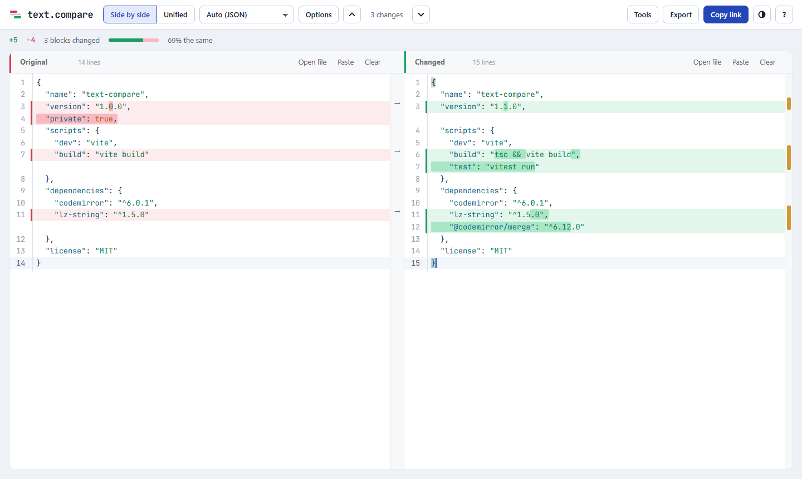

# text.compare

Compare two texts and see exactly what changed. No ads, no tracking, no sign-up.
Everything runs in your browser, so the text you paste is never uploaded anywhere.



## Features

**Seeing what changed**
- Side by side or unified views, with changes highlighted by whole word or by single character
- **Moved blocks** are shown in violet, with a tag that jumps to where the block went, instead of showing as a deletion and a separate addition
- Syntax highlighting for 100+ languages, detected from the file name or the text itself
- **Document mode** for prose: wrapped paragraphs in a readable serif, changes shown by word
- A change map beside the editor, <kbd>F7</kbd> / <kbd>Shift</kbd>+<kbd>F7</kbd> to jump between changes, and an option to hide unchanged lines

**Deciding what counts as a change**
- Ignore case, whitespace at line ends, all whitespace, or blank lines
- Ignore text matching patterns: dates and times, GUIDs, hex values, numbers, or your own regular expressions (handy for log files)

**Data, documents and images**
- **Data view** compares JSON by structure (key order ignored, lists of objects matched by id) and CSV/TSV tables by row and column (rows matched by a key column)
- Open **Word (.docx), Excel (.xlsx) and PDF** files. Their text is extracted in your browser
- **Image compare**: side by side, a slider, an overlay with adjustable opacity, and a pixel-difference view with the share of pixels that changed

**Editing and sharing**
- Both sides are editable, with undo, find and replace, and arrows that copy a block across
- Export a **report** (a self-contained HTML redline) or print it as a PDF, download a standard `.patch`, or copy the diff
- Share links that carry the text inside the link itself, with nothing stored on a server
- Tools to format JSON with sorted keys, sort lines, strip spaces at line ends, and swap sides
- Light and dark themes, a phone layout, and offline support once installed as an app
- Large texts are analysed in a background thread so the page stays responsive

## Privacy

The site is a set of static files with no backend, ads, web fonts or third-party scripts, and the
text you compare never leaves the browser. A copied link keeps the text in the part after `#`, which
browsers never send to a server; the page removes it from the address bar before any other script runs.

Analytics are optional and off by default. To count visits with Google Analytics 4, copy `.env.example`
to `.env.local` and set `VITE_GA_ID`. The tag then reports only the page address (never the `#` part),
turns off Google signals and ad personalisation, and keeps analytics cookies off by default for visitors in
the EEA, UK and Switzerland. The included Content Security Policy allows Google Analytics and nothing else.
"Remember my text on this device" is off by default and only uses your browser's local storage.

## Host your own copy

You need [Node.js](https://nodejs.org) 20 or newer.

```sh
git clone https://github.com/jamesclaypatton/text-compare.git
cd text-compare
npm install
npm run build        # produces the static site in dist/
```

Then serve `dist/` with any static web server. Some options:

**Caddy**

```caddyfile
text.example.com {
	root * /path/to/text-compare/dist
	encode gzip zstd
	header /assets/* Cache-Control "public, max-age=31536000, immutable"
	file_server
}
```

**Docker** (nginx, with caching and security headers set up)

```sh
docker build -t text-compare .
docker run -d -p 8080:80 --name text-compare text-compare
```

**GitHub Pages** (free): fork this repo, go to *Settings → Pages* and set *Source* to
*GitHub Actions*, then run the *Deploy to GitHub Pages* workflow from the *Actions* tab.

The build uses relative paths, so it works from a domain root or from a sub-folder.

Set `SITE_URL` to your own address when you build (for example `SITE_URL=https://diff.example.com npm run build`). It is used for canonical links, the sitemap and link previews, and defaults to `https://text.compare`. Page titles, descriptions and the text under the tool for each landing page live in `site/pages.ts`.

## Development

```sh
npm run dev          # local dev server with hot reload
npm test             # unit tests (Vitest)
npm run test:e2e     # browser tests (Playwright; run `npx playwright install chromium` once)
```

| Path | What it does |
| --- | --- |
| `src/diff-core.ts`, `src/seq-diff.ts` | Line diff (Myers), stats and `.patch` output |
| `src/worddiff.ts`, `src/moves.ts` | Word/character highlighting and moved-block detection |
| `src/structure.ts` | JSON and CSV/TSV structural comparison |
| `src/office.ts`, `src/pdf.ts`, `src/documents.ts` | Reading Word, Excel, PDF and image files |
| `src/report.ts` | The HTML report |
| `src/normalize.ts` | Comparison options (case, whitespace, blank lines) |
| `src/merge-override.ts` | Applies those options to the editor's diff |
| `src/editor.ts` | The CodeMirror side-by-side and unified views |
| `src/share.ts` | Encoding texts into share links |
| `src/lang.ts` | Language detection |
| `src/main.ts` | Page wiring: toolbar, files, export, theme |

Built with [CodeMirror 6](https://codemirror.net), [PDF.js](https://mozilla.github.io/pdf.js/), [fflate](https://github.com/101arrowz/fflate) and [lz-string](https://github.com/pieroxy/lz-string).

## License

[MIT](LICENSE). Use it, change it, host it.
