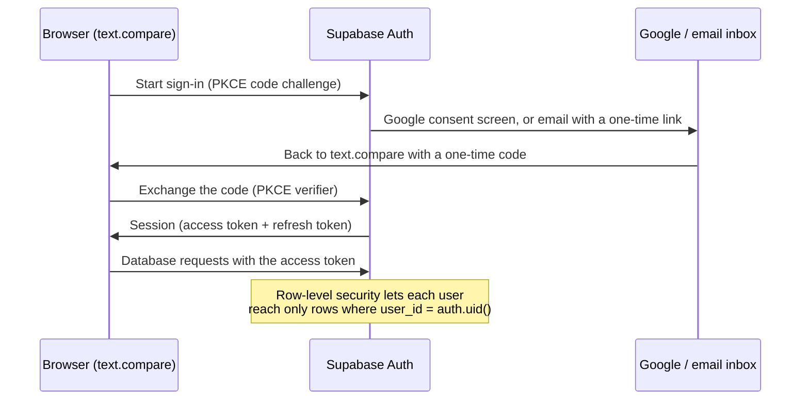

# Accounts with Supabase

text.compare works fully without accounts: comparing, history and saved comparisons all run in the
browser. Accounts are an optional extra that lets people keep their saved comparisons on every device.
This guide explains why they're built on [Supabase](https://supabase.com), how sign-in works, and how
to set it up for your own copy.

- [Why Supabase](#why-supabase)
- [How sign-in works](#how-sign-in-works)
- [What is stored](#what-is-stored)
- [Setting it up](#setting-it-up)
- [Which key goes where](#which-key-goes-where)
- [Running it day to day](#running-it-day-to-day)
- [Troubleshooting](#troubleshooting)

## Why Supabase

The site is a static app: there is no server of its own to hold passwords or sessions. Accounts
needed three things, and Supabase provides all of them as one service:

| Need | What Supabase provides |
|---|---|
| Sign-in without storing passwords | Google sign-in and one-time email links, with sessions and token refresh handled for us |
| A database the browser can talk to directly | Postgres behind an HTTP API, so the static site needs no backend of its own |
| Each person sees only their own data | Postgres row-level security, enforced in the database for every request |

Other reasons it fits this project:

- **The database never needs to be trusted with content.** Saves are encrypted in the browser before
  they're sent (see *Accounts and end-to-end encryption* in the [README](../README.md)), so Supabase
  only ever holds ciphertext.
- **Open source and portable.** Supabase is built on Postgres and can be self-hosted, and the whole
  schema is one file, [`supabase/schema.sql`](../supabase/schema.sql).
- **A free tier** that is enough for a small site.
- **Optional by design.** If the build has no Supabase settings, the Sign in button simply doesn't
  appear and everything stays in the browser.

## How sign-in works

There are no passwords to leak. People sign in with Google or with a link sent to their email:



- The app uses the **PKCE** flow ([`src/account/account.ts`](../src/account/account.ts)): the one-time
  code in the return address is useless without a secret the browser kept.
- Signing in with an email address that has no account creates one. There is no separate sign-up.
- After the first sign-in, the person chooses a **passphrase**. It never leaves the browser; it unlocks
  the key that encrypts their saves. Supabase knows who they are, but not what they saved.
- The sign-in dialog also has a box for being emailed about other apps. The choice is stored on the
  account (`contact_ok` in the user's metadata, with the time and the wording shown) and can be changed
  in account settings. Signing in again never overrides an earlier choice.

## What is stored

| Where | What |
|---|---|
| `auth.users` (managed by Supabase) | Email address, sign-in method, sign-up and last sign-in times, the contact preference |
| `public.user_keys` | The person's data key, locked by their passphrase and by their recovery code. Useless without them |
| `public.items` | Encrypted saved comparisons and history, plus owner, kind, size and timestamps |

Limits are enforced in the database: 100 MB and 1,000 saved comparisons per account, with history
trimmed to the latest 200. People can export everything, delete all their data, or delete their account
from the account screen; deleting the account removes every row.

## Setting it up

You need a Supabase project (free) and about fifteen minutes.

### 1. Create the project and the tables

1. Create a project at [supabase.com](https://supabase.com). Pick a region near your visitors.
2. Open **SQL Editor**, paste all of [`supabase/schema.sql`](../supabase/schema.sql) and run it.
   It creates the tables, row-level security, limits and functions. It is safe to run again, and you
   should run it again after updating, in case it has changed.
3. Optional check: the last lines of the file are two queries that show row-level security is on.

### 2. Email sign-in

Email links work out of the box, but Supabase's built-in email service sends only a few emails an
hour and is meant for testing.

1. Under **Authentication → Emails → SMTP Settings**, connect your own provider (for example
   [Resend](https://resend.com), Postmark or Amazon SES) and send from your own domain.
2. Optionally edit the **Magic Link** template under **Authentication → Emails → Templates** so the
   email is clearly from your site.

### 3. Google sign-in (optional)

1. In [Google Cloud Console](https://console.cloud.google.com), create a project, then set up the
   **OAuth consent screen** (External, with your site name, support email and the `email`, `profile`
   and `openid` scopes) and publish it.
2. Under **Credentials**, create an **OAuth client ID** of type *Web application*. Add this
   **Authorized redirect URI**: `https://<your-project-ref>.supabase.co/auth/v1/callback`
3. In Supabase, open **Authentication → Sign In / Providers → Google**, turn it on, and paste the
   client ID and client secret. The secret stays in Supabase; it never goes in the site.

### 4. Tell Supabase where your site is

Under **Authentication → URL Configuration**:

- **Site URL**: your address, for example `https://diff.example.com`
- **Redirect URLs**: add `https://diff.example.com/**` so sign-in can return to any page, including
  the landing pages. Add `http://localhost:5173/**` too if you develop locally.

### 5. Build the site with your settings

From **Project Settings → API Keys**, copy the project URL and the **publishable** key into
`.env.local`, then rebuild:

```sh
VITE_SUPABASE_URL=https://<your-project-ref>.supabase.co
VITE_SUPABASE_PUBLISHABLE_KEY=sb_publishable_...
```

```sh
npm run build
```

Your web server's Content Security Policy must allow `https://*.supabase.co` and
`wss://*.supabase.co` in `connect-src`. The included [`nginx.conf`](../nginx.conf) already does.

### 6. The admin panel (optional)

The server in [`server/`](../server) can list accounts in its admin panel: email, sign-in method, when
they joined and last signed in, how much they store, and their contact preference. It never sees
anything they saved. To turn this on, create a **secret** key under **Project Settings → API Keys**
and put it in `server/.env` (never in `.env.local`):

```sh
SUPABASE_URL=https://<your-project-ref>.supabase.co
SUPABASE_SERVICE_KEY=sb_secret_...
```

Then restart the server. The storage figures come from the `admin_user_usage()` function in
`schema.sql`, which only the secret key may call.

## Which key goes where

| Key | Looks like | Where it goes | Safe to publish? |
|---|---|---|---|
| Project URL | `https://<ref>.supabase.co` | `.env.local` and `server/.env` | Yes |
| Publishable key (was "anon") | `sb_publishable_...` | `.env.local`, built into the site | Yes. It can only do what row-level security allows |
| Secret key (was "service_role") | `sb_secret_...` | `server/.env` only | **No.** It bypasses row-level security. Never put it in the site or in git |
| Google client secret | from Google Cloud | Supabase dashboard only | No |

If a secret key is ever exposed, delete it under **Project Settings → API Keys**, create a new one and
update `server/.env`.

## Running it day to day

- **Free projects pause after a week without activity.** A paused project means sign-in stops working
  until you resume it in the dashboard. Regular visitors keep it awake; a paid plan never pauses.
- **Backups:** the free plan has no point-in-time recovery. Saves are encrypted, so a backup is only
  useful together with each person's passphrase, but you still want the tables if something goes wrong.
- **Removing someone:** delete the user under **Authentication → Users**. Their rows go with them.
- **Updating:** after pulling a new version, run `schema.sql` again, then rebuild.

## Troubleshooting

| Symptom | Likely cause |
|---|---|
| No Sign in button | The build had no `VITE_SUPABASE_URL` or publishable key. Check `.env.local` and rebuild |
| "Couldn't reach the account service" | The project is paused, or the Content Security Policy blocks `*.supabase.co` |
| Sign-in returns with "redirect URL not allowed" or goes to the wrong site | Add your address with `/**` under **Redirect URLs** and check the **Site URL** |
| Google says `redirect_uri_mismatch` | The redirect URI in Google Cloud must be exactly `https://<ref>.supabase.co/auth/v1/callback` |
| Sign-in emails don't arrive | The built-in email limit is hit; connect SMTP (step 2) and check the spam folder |
| "permission denied" when saving | `schema.sql` wasn't run, or was run in another project |
| Admin panel says to add a key, or shows no storage figures | Set `SUPABASE_SERVICE_KEY` in `server/.env`, re-run `schema.sql`, restart the server |
